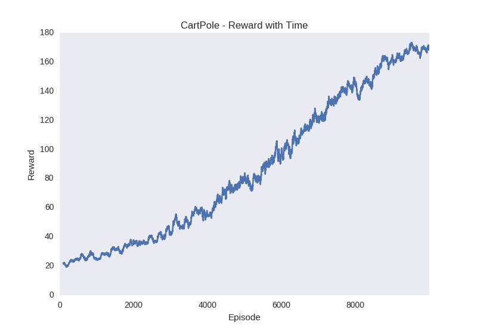
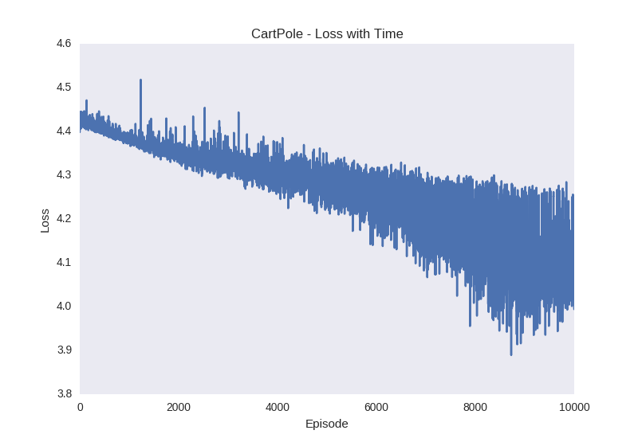

# Categorical DQN
Attempt at CNTK implementation of Categorical DQN from 'A distributional Perspective on Reinforcement Learning' found [here](https://arxiv.org/pdf/1707.06887.pdf).

## Dependencies
1. Python 3
2. CNTK v2

### CartPole-v0
To train a model for CartPole from OpenAI Gym, use:
```bazaar
python -m experiments.train_cartpole
```

To watch the trained model in action, use:

```
python -m experiments.watch_cartpole
```
Here are the results from a sample run:




### Atari
Work in progress